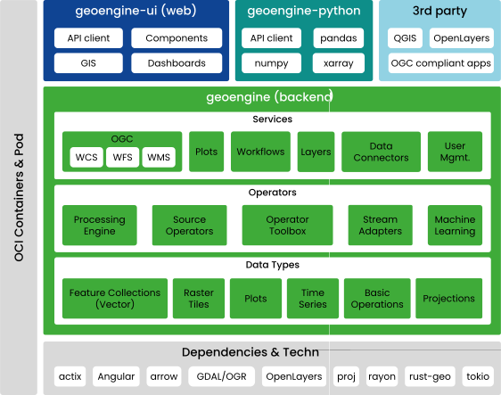

# The Geo Engine

Geo Engine is a cloud-ready geo-spatial data processing platform.
Here, we give an overview about its architecture and describe the main components.

## Architecture

<!--
Take from Google Slide…
 - export as SVG,
 - Crop with Inkscape,
 - and scale x2.
-->

Geo Engine consists out of the backend and several frontends.
The backend is subdivided into three subcomponents: services, operators and data types.
Data types specify primitives like feature collections for vector or gridded raster data.
Moreover, it defines plots and basic operations, e.g., projections.
Operators contains the processing engine and operators, i.e., source operators, raster- and vector time series processing.
Furthermore, there are raster time series stream adapters, which can be used as building blocks for operators.
Services contains procotols, e.g., OGC standard interfaces, as well as Geo Engine specific interfaces.
These can be workflow registration, plot queries and data upload.
Each of the subcomponents can have additions in Geo Engine Pro, for instance, User Management, which is only available in Geo Engine Pro.

Frontends for the Geo Engine are `geoengine-ui` for building web applications on top of Geo Engine.
`geoengine-python` offers a Python library that can be used in Jupyter Notebooks.
3rd party applications like QGIS can access Geo Engine via its OGC interfaces.

All components of Geo Engine are fully containerized and Docker-ready.
Geo Engine builds upon several technologies, including: GDAL, arrow, Angular or OpenLayers.
