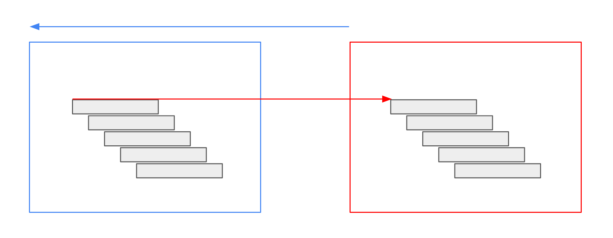

# TimeShift

The `TimeShift` operator allows retrieving data temporally relative to the actual [`QueryRectangle`](./../datatypes/queryrectangle.md).
It shifts the query rectangle by a given amount of time and modifies the result data accordingly.
Users have two options for specifying the time shift:

1. Relative shift – shift relatively to the query rectangle, e.g., one month or one year to the past.
   This can be useful for comparing multiple points in time relative to the query rectangle.
2. Absolute shift – change query rectangle to a fixed temporal reference, e.g., January 2014.
   This can be used to compare data in the query rectangle's time to a fixed point of reference.

The output is either a stream of raster data or a stream of vector data depending on the input.

An example usage scenario is to compare the current time with the previous time of the same raster data.
For instance, a raster source outputs monthly data aggregates of mean temperatures.
If you want to compute the difference between the current month and the previous month, you can use the `TimeShift` operator.
You will have two workflows.
One is the unmodified temperature raster source.
The other is the same source, shifted by one month.
Then, you can use both workflows as sources of an [`Expression`](./expression.md) operator.

_Note_: This operator modifies the time values of the returned data.
For rasters and vector data, it shifts the time intervals opposite to the time shift specified in the operator.
This is necessary to have only data inside the result that is part of the [`QueryRectangle`'s](./../datatypes/queryrectangle.md) time interval.
As an example, we shift monthly data by one month to the past.
Our query rectangle points to February.
Then, the operator shifts the query rectangle to January.
The data, originally valid for January, is shifted forward to February again, to fit into the original query rectangle, which is February.


## Parameters

| Parameter | Type                     | Description                  | Example Value         |
| --------- | ------------------------ | ---------------------------- | --------------------- |
| `type`    | `relative` or `absolute` | shift relatively or absolute | <pre>"relative"</pre> |

### Relative

If `type` is `relative`, you need to specify the following parameters:

| Parameter     | Type                                        | Description                        | Example Value       |
| ------------- | ------------------------------------------- | ---------------------------------- | ------------------- |
| `granularity` | [`TimeGranularity`](/datatypes/timestep.md) | time granularity and for the shift | <pre>"months"</pre> |
| `value`       | `integer`                                   | the size of the step               | <pre>-1</pre>       |

### Absolute

If the `type` is `absolute`, you need to specify the following parameters:

| Parameter      | Type                                         | Description                                                                      | Example Value                                                                                                               |
| -------------- | -------------------------------------------- | -------------------------------------------------------------------------------- | --------------------------------------------------------------------------------------------------------------------------- |
| `timeInterval` | [`TimeInterval`](/datatypes/timeinterval.md) | A fixed shift of the [`QueryRectangle`'s](./../datatypes/queryrectangle.md) time | <pre><code>{<br>&nbsp;&nbsp;"start": "2010-01-01T00:00:00Z",<br>&nbsp;&nbsp;"end": "2010-02-01T00:00:00Z"<br>}</code></pre> |

## Inputs

The `TimeShift` operator expects either one _vector_ input or one _raster_ input.

| Parameter | Type                         |
| --------- | ---------------------------- |
| `source`  | `SingleRasterOrVectorSource` |

## Example JSON

```json
{
  "type": "TimeShift",
  "params": {
    "type": "relative",
    "granularity": "months",
    "value": -1
  },
  "sources": {
    "source": {
      "type": "GdalSource",
      "params": {
        "data": "ndvi"
      }
    }
  }
}
```

```json
{
  "type": "TimeShift",
  "params": {
    "type": "absolute",
    "time_interval": {
      "start": "2010-01-01T00:00:00Z",
      "end": "2010-02-01T00:00:00Z"
    }
  },
  "sources": {
    "source": {
      "type": "GdalSource",
      "params": {
        "data": "ndvi"
      }
    }
  }
}
```
