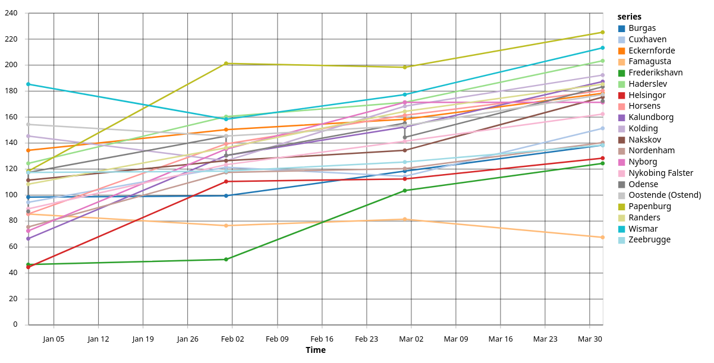

# FeatureAttributeValuesOverTime

The `FeatureAttributeValuesOverTime` is a _plot operator_ that computes a multi-line plot for feature attribute values over time.
For distinguishing features, the data requires an id column.
The output is a plot in Vega-Lite specification.



For instance, you want to plot the NDVI values of a feature collection of trees.
Then, you can use a multi-line plot to visualize the trees by their id.

## Parameters

| Parameter     | Type     | Description                                                | Example Value   |
| ------------- | -------- | ---------------------------------------------------------- | --------------- |
| `idColumn`    | `string` | The column name of the `id` attribute (one line per `id`.) | `"id"`          |
| `valueColumn` | `string` | The column name of the `value` attribute (y-axis values).  | `"temperature"` |

## Inputs

The operator consumes exactly one _vector_ operator.

| Parameter | Type                 |
| --------- | -------------------- |
| `vector`  | `SingleVectorSource` |

## Errors

The operator returns an error if the selected columns ( `idColumn` and `valueColumn`) do not exist or `valueColumn` is not numeric.

## Notes

The operator processes a maximum of `20` different ids.
After recognizing more than `20` different ids, the operator ignores the rest.

## Example JSON

```json
{
  "type": "FeatureAttributeValuesOverTime",
  "params": {
    "idColumn": "id",
    "valueColumn": "temperature"
  },
  "sources": {
    "vector": {
      "type": "OgrSource",
      "params": {
        "data": "ndvi"
      }
    }
  }
}
```
